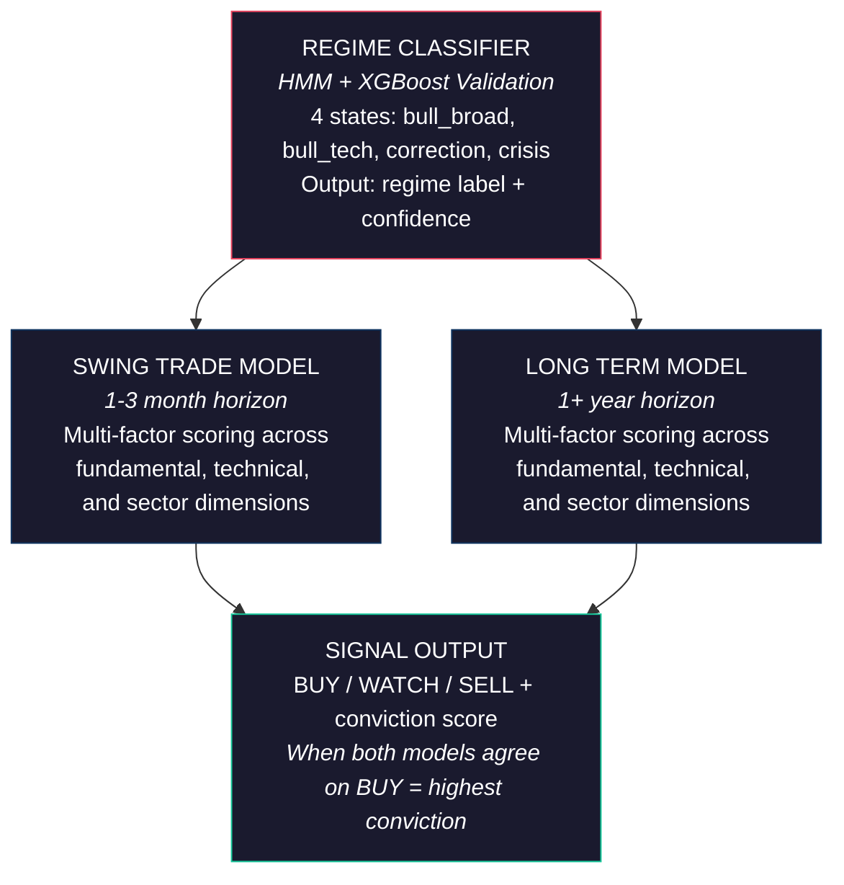

# Aerondight Systems Architecture

```mermaid
graph TD
    A["REGIME CLASSIFIER<br/><i>HMM + XGBoost Validation</i><br/>4 states: bull_broad, bull_tech, correction, crisis<br/>Output: regime label + confidence"] --> B
    A --> C
    B["SWING TRADE MODEL<br/><i>1-3 month horizon</i><br/>Multi-factor scoring across<br/>fundamental, technical, and sector dimensions"] --> D
    C["LONG TERM MODEL<br/><i>1+ year horizon</i><br/>Multi-factor scoring across<br/>fundamental, technical, and sector dimensions"] --> D
    D["SIGNAL OUTPUT<br/>BUY / WATCH / SELL + conviction score<br/><i>When both models agree on BUY = highest conviction</i>"]

    style A fill:#1a1a2e,stroke:#e94560,color:#fff
    style B fill:#1a1a2e,stroke:#0f3460,color:#fff
    style C fill:#1a1a2e,stroke:#0f3460,color:#fff
    style D fill:#1a1a2e,stroke:#16c79a,color:#fff
```
