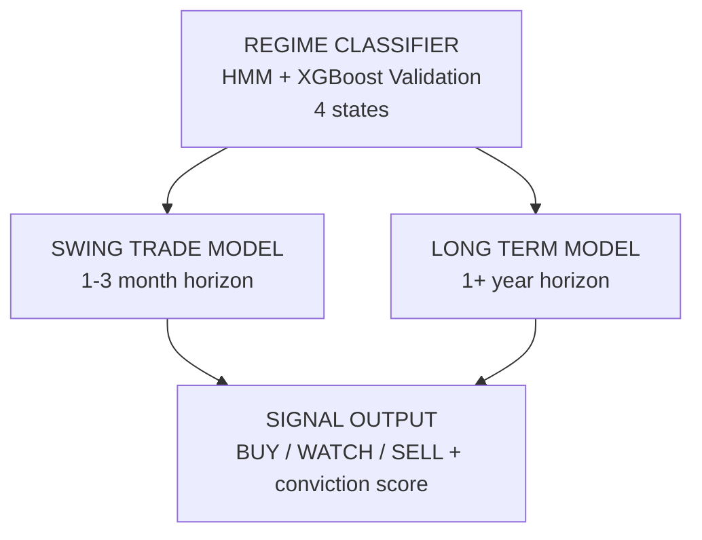

Aerondight Systems is built as a three-layer pipeline. Each layer has a distinct job, and the output of one feeds into the next.

## Layer 1: Regime Classifier

At the top sits a **Hidden Markov Model (HMM)** paired with an **XGBoost validator**. Together, they classify the current market environment into one of four states:

- **Bull Broad** — real economy rallying, broad participation, low volatility
- **Bull Tech** — tech-led narrow rally, weak breadth
- **Correction** — grinding bear, elevated volatility
- **Crisis** — sharp crash, extreme volatility, rare but devastating

When both models agree on the regime, signal confidence increases. The regime label feeds directly into the scoring engine — the same stock can score differently in a broad bull market versus a grinding correction.

## Layer 2: Dual Scoring Models

Two parallel models score every stock in the universe (~900 S&P 500 + S&P 400 MidCap names):

**Swing Trade Model** — 1-3 month horizon. Optimized for capturing intermediate moves. Multi-factor scoring across fundamental, technical, and sector dimensions.

**Long Term Model** — 1+ year horizon. Built for patient capital. Same factor categories, different weights and sensitivity to regime shifts.

Each stock receives a **conviction score** (1-10) and a clear signal: **BUY**, **WATCH**, or **SELL**.

## Layer 3: Signal Output

The final layer synthesizes both models. When the swing trade and long-term models both agree on BUY, the system outputs its highest conviction signal. Signal *transitions* matter more than static signals — a stock moving from WATCH to BUY is an entry trigger.

This architecture keeps each component focused and testable. The regime classifier doesn't know about individual stocks. The scoring models don't decide market conditions. And the signal output simply asks: do these independent assessments agree?
